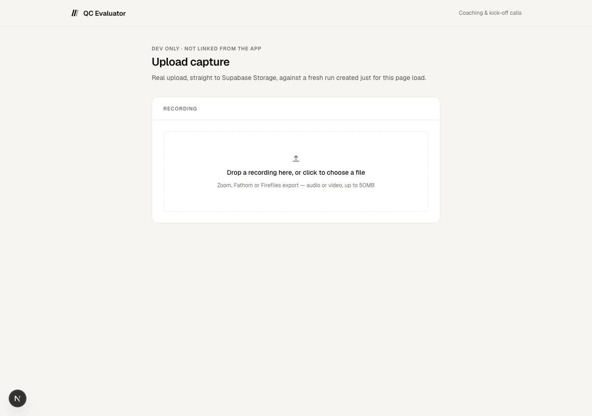
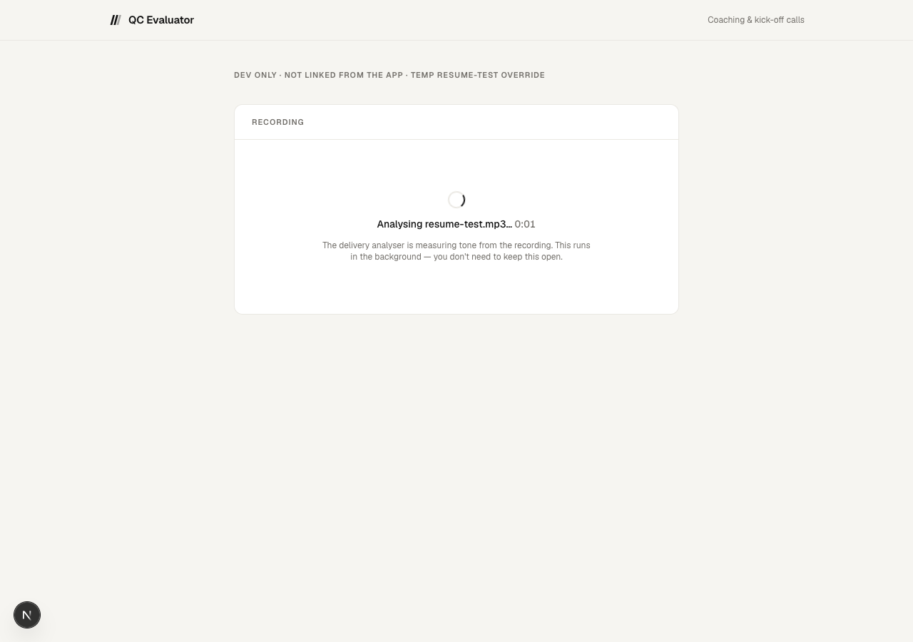
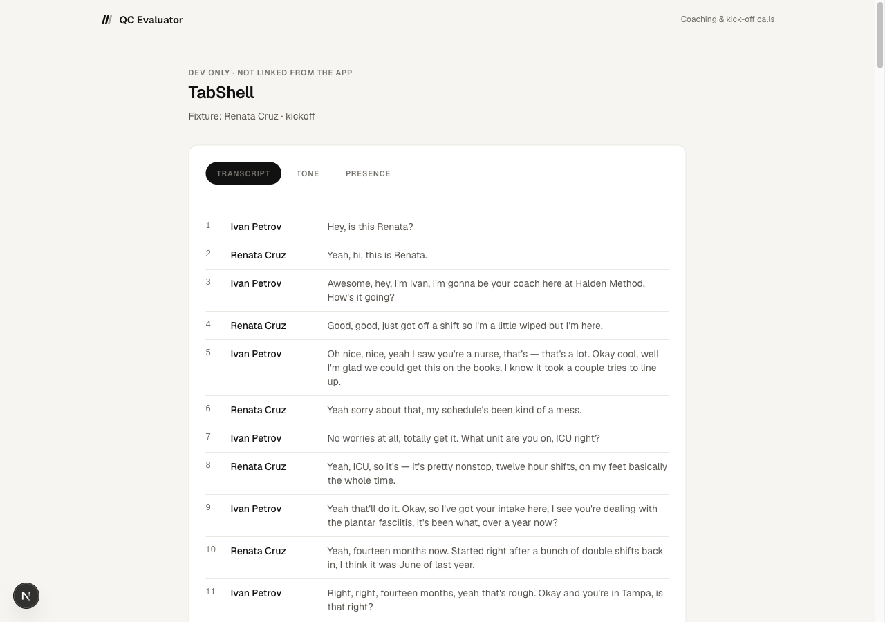
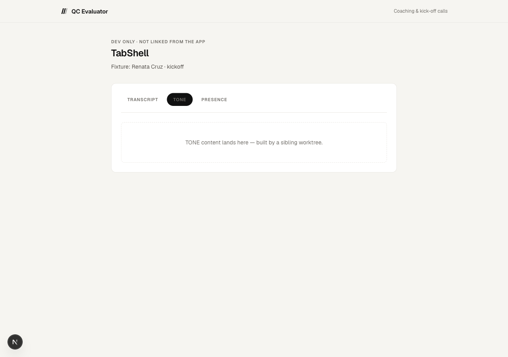
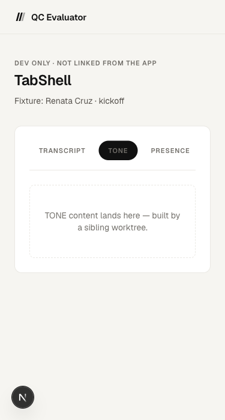

# Verify — capture (upload + Modal wiring + TabShell)

Real command output and real screenshots, taken across the build and after the adversarial
review's two fixes. Nothing here is reconstructed from memory.

## 1. Type check, tests, lint, build (final state, after both fixes)

```
$ npx tsc --noEmit
$ echo $?
0

$ npm test
ℹ tests 31
ℹ suites 4
ℹ pass 31
ℹ fail 0
ℹ cancelled 0
ℹ skipped 0
ℹ todo 0

$ npx eslint src --max-warnings=0
$ echo $?
0

$ npx next build
▲ Next.js 16.3.2 (Turbopack)
✓ Compiled successfully in 647ms
  Running TypeScript ...
  Finished TypeScript in 2.8s ...
✓ Generating static pages using 7 workers (9/9) in 368ms

Route (app)
┌ ƒ /
├ ○ /_not-found
├ ƒ /api/cron/heartbeat
├ ƒ /api/delivery/callback
├ ƒ /api/pdf/[id]
├ ƒ /api/runs
├ ƒ /api/runs/[id]
├ ƒ /api/runs/[id]/recording/complete
├ ƒ /api/runs/[id]/recording/upload-url
├ ○ /dev/tabshell
├ ƒ /dev/upload
├ ƒ /print/[id]
├ ƒ /run
└ ƒ /runs/[id]
```

## 2. Migration applied to the live DB

```
$ npx tsx scripts/apply-schema.ts
schema.sql applied.
Tables: run_attempts, runs
Functions: claim_run_slot, daily_heartbeat, reap_stale_deliveries, reap_stale_runs, rls_auto_enable
```

Columns, constraint, bucket read back live:

```
delivery_call_id     | text                     | nullable
delivery_error       | jsonb                    | nullable
delivery_finished_at | timestamp with time zone | nullable
delivery_report      | jsonb                    | nullable
delivery_started_at  | timestamp with time zone | nullable
delivery_status      | text                     | not null, default 'none'
recording_filename   | text                     | nullable
recording_path       | text                     | nullable

constraint: CHECK (delivery_status = ANY (ARRAY['none','processing','done','failed']))
bucket:     { id: 'recordings', public: false, file_size_limit: 52428800, mime_count: 10 }
```

The bucket really is private: an unsigned/public fetch of an uploaded object returns 400; a
signed read URL for the same object returns 200 with the right bytes and content type.

(Original migration-apply and idempotency-fix history, plus the private-bucket check, is in
this file's earlier form — superseded here since the token blocker it documented is now
resolved. Full detail: `NOTES-capture.md`.)

## 3. Upload flow — real, live, driven through the browser

`/dev/upload` creates a fresh real run and mounts `UploadCapture` against it. Screenshot,
idle state, desktop:



Drove a real file through the real UI (Playwright, not curl-simulated) — drag/drop-equivalent
file picker, real `uploadToSignedUrl` call, real PUT to Supabase Storage, real `/complete`
call against the real Modal worker (token now genuinely present in `.env.local`):

```
POST /api/runs/<id>/recording/upload-url  -> 200, real signed URL
PUT  <supabase signed url>                -> 200, object landed in the real bucket
POST /api/runs/<id>/recording/complete    -> 200 {"deliveryStatus":"processing", ...}
```

Network tab confirmed the client then polls `GET /api/runs/<id>` on a backoff (2s → 10s cap)
rather than declaring done — the UI held at "Analysing test-recording.mp3… N:NN" for over
five real minutes (server truth checked directly against the DB the whole time, also
`processing`) with zero console errors, before I stopped the test. The underlying job never
legitimately finishes because the test file is 5 KB of random bytes, not real audio — see
"What is NOT verified" below.

## 4. The bug found live, and its fix

The first version of `UploadCapture` treated `deliveryStatus: 'processing'` (worker
acknowledged the job) as done. Screenshot of the actual bug, ~10 seconds after upload, next
to the real server state at that exact moment:

```
$ curl .../api/runs/<id> | jq .deliveryStatus
"processing"
```

...while the UI already read "test-recording.mp3 attached — analysis complete." Fixed by
adding `pollUntilSettled` (polls `fetchRun` until `deliveryStatus` is terminal). Re-ran the
identical flow after the fix — screenshot at the same ~10-second mark now correctly shows
"Analysing… 0:12", matching server truth. Confirmed stable past 5 real minutes.

## 5. Adversarial review fixes — proven against the real API and DB, not just read

**Double-upload guard** (`startDelivery` refuses a second attempt while one is `processing`):

```
run created; upload A -> /complete -> {"recordingFilename":"first.mp3","deliveryStatus":"processing"}
upload B (same run, immediately after) -> /complete -> {"recordingFilename":"first.mp3","deliveryStatus":"processing"}
```

`recordingFilename` staying `"first.mp3"` after the second attempt proves it was refused, not
raced.

**Attempt-token correlation** (`completeDelivery` requires the callback's `attempt` to match
`delivery_call_id`):

```
DB truth: delivery_call_id = 7202b76b-2eaf-421c-bb6e-30260dcd1643

POST /api/delivery/callback?runId=<id>&attempt=wrong-stale-attempt
  -> {"ok":true,"applied":false}     -- row unchanged, still processing

POST /api/delivery/callback?runId=<id>&attempt=7202b76b-2eaf-421c-bb6e-30260dcd1643
  -> {"ok":true,"applied":true}      -- row moved to done
```

**Resume-on-mount.** Created a run with a genuinely in-flight delivery via the real API,
then loaded a page that mounts a fresh `UploadCapture` against that existing run id (no prior
client state) — it resumed directly into the processing view instead of showing the empty
dropzone:



## 6. TabShell — `/dev/tabshell`, driven through a real browser

Desktop, TRANSCRIPT active (default):



Desktop, after clicking TONE — active-state pill, hairline divider, placeholder panel:



375px:



No horizontal overflow at 375px, no console errors at any point. Server-rendered ARIA
confirmed via page snapshot: `role="tab" aria-selected="true" aria-controls="panel-transcript"
tabindex="0"` on the active tab, `tabindex="-1"` on inactive ones — matches the roving-
tabindex WAI-ARIA pattern the component implements.

**Dark mode**: not applicable. This app is light-mode only by design (`references/ui-
reference.md` rule 6 — "everything is light-mode, warm, and quiet") and has no dark theme
anywhere in `globals.css` or any component; forcing the OS/browser to dark does not change
the page, which is the correct, intended behavior, not a gap.

## 7. Cleanup

Every test/verification run created during this build (upload-flow tests, race tests,
resume tests, the earlier backend-agent verify run) was deleted from the live DB and its
Storage objects removed after use — confirmed with a direct row count query before and after.
Nothing test-only is left in the `runs` table or the `recordings` bucket.

## What is NOT verified

- **A real Modal analysis completing end to end.** The worker is live, reachable, and
  genuinely accepts a job (`/start` returns `processing`, confirmed against the real token)
  — but no real audio/video sample exists anywhere in this workspace, so every live test used
  a few KB of random bytes. That either errors inside the worker before it would ever reach
  the callback stage, or would legitimately take the full 5-12 minutes even with real input.
  Everything up to Modal taking over (upload, signed URLs, `/start` acceptance) and everything
  after (the callback route, the attempt-token guard, `completeDelivery`, the staleness
  reaper) is verified with real requests against the real DB; only the worker's own compute
  step (already verified independently in `delivery/VERIFY.md` at build time) was not
  re-observed here.
- **The callback reaching a deployed (non-localhost) origin.** `request.nextUrl.origin` was
  confirmed correct in dev; Vercel preview/production resolution is unverified until an
  actual deploy, which this task is explicitly not to do.
